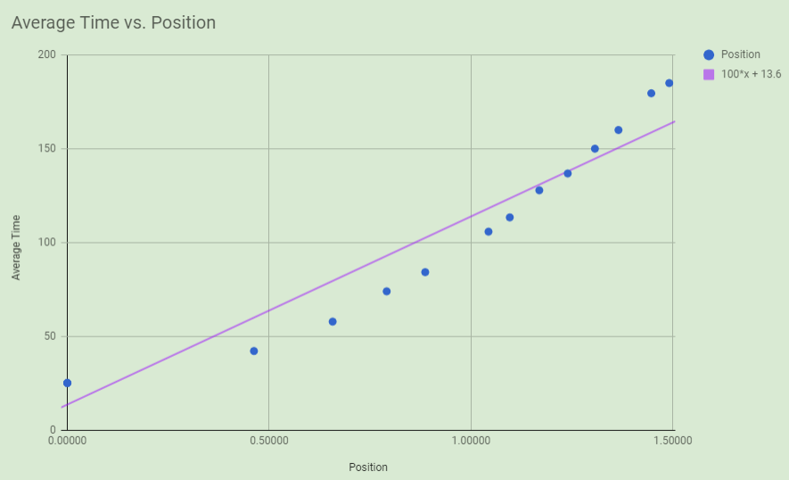

# Lab 3

## Track Angle:
  8.5 +/- 0.02

## Data:

### Data Uncertainty:

|  Run 1  |  Run 2  |  Run 3  |  Run 4  |  Run 5  |  Run 6  |  Run 7  |  Run 8  |  Run 9  |  Run 10 |
| :-----: | :-----: | :-----: | :-----: | :-----: | :-----: | :-----: | :-----: | :-----: | :-----: |
| 1.43885 | 1.45604 | 1.44440 | 1.45340 | 1.45049 | 1.46933 | 1.46341 | 1.45693 | 1.45624 | 1.46769 |

### Set 1

| Position |   Run 1  |   Run 2  |   Run 3  | Average: |
| :------: | :------: | :------: | :------: | :------: |
|  25.05   | 0.00000  | 0.00000  | 0.000000 | 0.00000  |
|  73.92   | 0.78359  | 0.80027  | 0.78923  | 0.79103  |
|  127.80  | 1.16147  | 1.17852  | 1.16715  | 1.16905  |
|  179.55  | 1.43885  | 1.45604  | 1.44440  | 1.44643  |

### Set 2:

| Position |   Run 1  |   Run 2  |   Run 3  | Average  |
| :------: | :------: | :------: | :------: | :------: |
| 25.05    | 0.00000  | 0.00000  | 0.00000  | 0.00000  |
| 84.15    | 0.88538  | 0.89141  | 0.88254  | 0.88644  |
| 105.75   | 1.04217  | 1.04820  | 1.03934  | 1.04324  |
| 149.99   | 1.30581  | 1.31179  | 1.30294  | 1.30685  |

### Set 3:

| Position |   Run 1  |   Run 2  |   Run 3  | Average  |
| :------: | :------: | :------: | :------: | :------: |
| 25.05    | 0.00000  | 0.00000  | 0.00000  | 0.00000  |
| 57.77    | 0.66178  | 0.64780  | 0.66192  | 0.65717  |
| 136.78   | 1.24416  | 1.23005  | 1.24434  | 1.23952  |
| 185.00   | 1.49553  | 1.48147  | 1.49572  | 1.49091  |

### Set 4:

| Position |   Run 1  |   Run 2  |   Run 3  | Average  |
| :------: | :------: | :------: | :------: | :------: |
| 25.05	   | 0.00000  |	0.00000	 | 0.00000	| 0.00000  |
| 42.09	   | 0.45726  |	0.46595	 | 0.46353	| 0.46225  |
| 113.35   | 1.09108  |	1.09949	 | 1.09724	| 1.09594  |
| 159.95   | 1.36031  |	1.36882	 | 1.36646	| 1.36520  |

### Graph:

